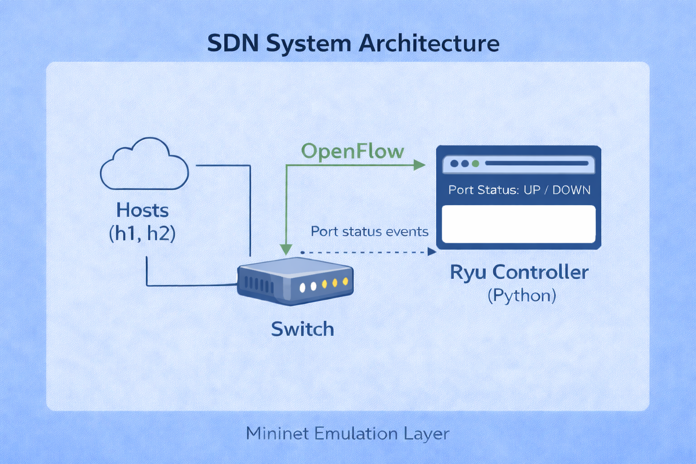

# Port-Status-Monitor
Course: Computer Networks - SDN_Mininet Project

Author:
- Kundan V - PES1UG24CS243

---

## Project Overview
This project implements an SDN-based port status monitoring system using the Ryu controller and Mininet network emulator. The objective is to monitor network link conditions in real time by detecting port status changes (UP/DOWN) in an OpenFlow-enabled switch. The system leverages the event-driven architecture of Software Defined Networking (SDN), where the controller continuously listens for port status events and logs them as informational messages or alerts. This enables dynamic visibility into network behavior and helps in identifying link failures instantly.

The project uses a simple topology consisting of two hosts connected to a single switch, managed by a remote Ryu controller. Through Mininet, network conditions such as link failures are simulated, and the controller responds by generating logs indicating port state changes. Connectivity between hosts is validated using ping tests, demonstrating how link disruptions affect communication. Overall, the project showcases the practical implementation of SDN concepts such as controller-switch interaction, OpenFlow messaging, and real-time network monitoring in a controlled virtual environment.

---

## Problem Statement
Traditional networks do not provide real-time visibility of port status, making it difficult to detect link failures and monitor network conditions efficiently. Manual monitoring is time-consuming and prone to delays, which can affect network reliability and performance.

---

## Objective
To develop an SDN-based port status monitoring system using Ryu and Mininet that detects port UP/DOWN events, logs changes, generates alerts, and displays real-time network status through controller-switch interaction using OpenFlow.

---

## Features
- Real-time detection of port status changes (UP/DOWN)  
- Event-driven monitoring using Ryu controller  
- Logging of port state changes in the controller terminal  
- Alert generation for link failures and port disconnections  
- Dynamic simulation of network conditions using Mininet  
- Controller–switch interaction using OpenFlow protocol  
- Verification of network connectivity through host communication (ping)  
- Simple and scalable topology for easy testing and analysis

---

## System Architecture
<p align="center">
  
</p>

The system follows an SDN architecture where the data plane (switch) and control plane (Ryu Controller) are separated. Mininet is used to emulate the network with hosts (h1, h2) connected to a switch.

The switch communicates with the Ryu Controller using the OpenFlow protocol. Whenever a packet arrives and no matching rule is found, the switch sends it to the controller. The controller processes the packet, makes forwarding decisions, and installs flow rules in the switch.

Additionally, the switch sends port status events to the controller whenever a link goes UP or DOWN. The controller logs these changes and generates alerts, enabling real-time monitoring and efficient network management.

Flow:
```
Host → Switch → Controller → Decision → Switch
```

---

## Working of Ryu Controller and SDN Logic
The controller follows an event-driven model, meaning it reacts to network events instead of continuously polling the network. Whenever a packet arrives at the switch and no matching flow rule exists, the switch sends a packet_in message to the Ryu Controller. The controller then decides how to handle the packet and installs appropriate flow rules in the switch.

The controller also listens for EventOFPPPortStatus events to detect changes in port states. When a port becomes active (UP), it logs the event as an informational message (INFO). When a port goes down (DOWN), it generates an alert (ALERT), helping in real-time network monitoring and debugging.

By default, the controller implements a flooding mechanism when it does not know the destination, forwarding packets to all ports except the incoming one. Once the correct path is learned, flow rules are installed so that future packets are forwarded directly without involving the controller, improving efficiency.

---

## Installation and Setup
1. Activate Virtual Environment  
Activate the Python virtual environment where Ryu is installed:
```bash
source ryu-env310/bin/activate  
```
2. Start Ryu Controller  
Run the controller application to monitor port status events:  
```bash
ryu-manager controller/port_monitor.py  
```
3. Launch Mininet Topology  
Start Mininet with the custom topology and connect it to the remote controller:  
```bash
sudo mn --custom topology/topo.py --topo mytopo --controller remote  
```
4. Verify Setup  
Once Mininet CLI opens, ensure hosts and switch are created correctly (h1, h2, s1) and the controller is connected.  
You can test connectivity using:
```
mininet> pingall
```

---

## Execution Workflow
1. Run Controller  
Activate the virtual environment and start the Ryu controller to monitor port status:  
```bash
source ryu-env310/bin/activate  
ryu-manager controller/port_monitor.py  
```
2. Run Mininet  
Start the custom Mininet topology and connect it to the remote controller:  
```bash
sudo mn --custom topology/topo.py --topo mytopo --controller remote  
```
3. Ping Test  
Check connectivity between hosts to ensure the network is working:  
```
mininet> h1 ping h2  
```
4. Link Down  
Simulate a link failure between switch and host:  
```
mininet> link s1 h1 down  
```
Observe that the controller logs an ALERT for port DOWN and connectivity is lost.  

5. Link Up  
Restore the link to bring the network back to normal:  
```
mininet> link s1 h1 up  
```
Run ping again to verify connectivity and observe INFO log for port UP.

---

## Testing & Validation
1. Ping Success (Normal Condition)  
Initially, a ping test is performed between hosts (h1 → h2) to verify that the network is functioning correctly. Successful replies confirm that flow rules are properly installed and communication is established.

2. Link Down Scenario  
The link between switch and host is manually brought down using:  
```
mininet> link s1 h1 down  
```
After this, ping fails and shows “Network is unreachable”. This validates that the controller correctly detects the port DOWN event and connectivity is lost.

3. Link Up Scenario  
The link is restored using:  
```
mininet> link s1 h1 up  
```
Ping is executed again and becomes successful, confirming that the network recovers. The controller logs the port UP event and normal communication resumes.

---

## Performance Analysis
1. Ping Latency  
Round-trip time (RTT) values from the ping command are observed to analyze network delay under normal conditions.

2. Packet Loss During Failure  
When the link is down, packet loss becomes 100%, indicating complete communication failure. This helps validate correct failure detection.

3. Network Behavior Observation  
The system behavior is analyzed in different states (normal, link down, link up). The controller logs (INFO/ALERT) and Mininet outputs are used to explain how the network dynamically adapts to changes.

---

## Sample Output
Example logs generated by the Ryu controller during port status changes:
```
[INFO] Port 1 UP  
[ALERT] Port 1 DOWN  
```
When a port becomes active (UP), the controller logs it as an informational message indicating normal operation.  
When a port goes down (DOWN), the controller generates an alert, indicating a failure or disconnection in the network.  

These logs help in real-time monitoring and quick identification of network issues.

---

## Technologies Used
• Python  
Used as the primary programming language to implement the Ryu controller logic and handle network events.

• Ryu  
An SDN controller framework that enables communication with switches using OpenFlow and supports event-driven programming.

• Mininet  
A network emulator used to create virtual hosts, switches, and links for testing SDN concepts in a controlled environment.

• OpenFlow  
A communication protocol that allows the controller to interact with switches, install flow rules, and receive network events.

---

## Project Structure
```
Port-Status-Monitor/
│
├── Architecture/
│   └── Architecture.png
├── controller/
│   └── port_monitor.py
├── Screenshots/
│   ├── 1_Controller Running.png
│   ├── 2_Mininet Topology Creation.png
│   ├── 3_Initial Ping Success.png
│   ├── 4_Link Down.png
│   ├── 5_Link Down Controller Logs.png
│   ├── 6_Link Up.png
│   └── 7_Link Up Controller Logs.png
├── topology/
│   └── topo.py
├── .gitignore
└── README.md
```

---

## Future Improvements
• Add GUI Dashboard  
Develop a graphical interface to visualize port status, logs, and network topology in real time.

• Store Logs in File/Database  
Instead of printing logs only on the terminal, store them persistently for later analysis and auditing.

• Add Traffic Monitoring (iperf)  
Integrate tools like iperf to measure throughput and analyze network performance under different conditions.

• Implement Learning Switch  
Enhance the controller to learn MAC addresses dynamically and forward packets intelligently instead of using flooding.

---

## License
This project is created for educational purposes as part of a Computer Networks project.
